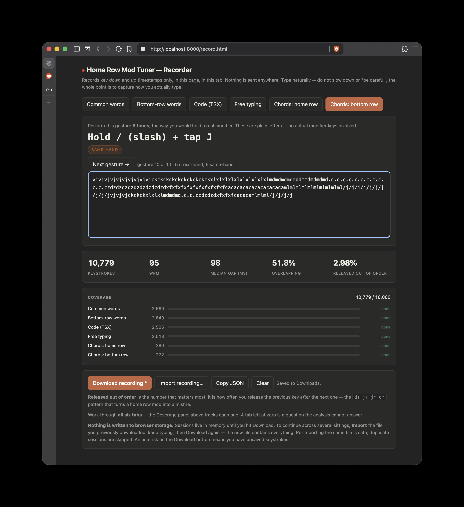

# Home Row Mod Tuner

Measure whether home row mods are viable *for the way you actually type*, before
flashing anything.

Records your real keystroke timings, then replays them through a simulation of
ZMK's hold-tap state machine to count how many letters would have turned into
modifiers — and how many intentional modifiers would have turned into letters.

If you are reading this because the keymap in this repo has a BRM layer and you
want to know where its numbers came from, see
**[DECISIONS.md](DECISIONS.md)** — every parameter, what it costs, what was
rejected, and what to change first when something annoys you.

## Why

Every home row mod guide tells you to pick timings and iterate on feel. That is
how you end up with misfires you cannot explain and eventually give up. The
numbers that matter are properties of your own typing, and they are measurable.

The specific failure this tool exists to quantify:

```
d↓  j↓  j↑  d↑        you meant "dj"
```

With `flavor = "balanced"`, a hold fires when another key is **pressed and
released** while the hold-tap is held. With `hold-trigger-on-release`, the
opposite-hand check runs at that key's release — and a cross-hand key is
*allowed* to trigger the hold. So this sequence produces `Mod+J`.

Same-hand rolls are protected by `hold-trigger-key-positions`.
**Cross-hand rolls are protected by `require-prior-idle-ms` and nothing else.**
That parameter is the whole ballgame, which is why this tool sweeps it.

## Requirements

Two things, both of which you may already have.

| | why |
| --- | --- |
| **A modern browser** | runs `record.html`. Chrome, Firefox, Safari or Edge, any recent version |
| **Python 3.7+** | runs `analyze.py`. 3.9 or newer recommended |

**There are no packages to install.** `analyze.py` uses only the Python standard
library — no `pip install`, no virtualenv, no `requirements.txt`. If you have
Python, you can run it.

### Do I already have Python?

```sh
python3 --version        # macOS / Linux
py -3 --version          # Windows
```

Anything `3.7.0` or higher works. If you get "command not found", install it
below.

### Installing Python

**macOS** — recent macOS does not ship Python by default. Easiest route:

```sh
xcode-select --install                  # ships a usable python3
```

or with [Homebrew](https://brew.sh):

```sh
brew install python
```

or download the installer from [python.org/downloads](https://www.python.org/downloads/).

**Windows** — from PowerShell:

```powershell
winget install Python.Python.3.12
```

or install "Python 3" from the Microsoft Store, or use the
[python.org installer](https://www.python.org/downloads/windows/) — if you use
that one, **tick "Add python.exe to PATH"** on the first screen.

On Windows, use `py -3` wherever this README says `python3`.

**Linux** — nearly always preinstalled. If not:

```sh
sudo apt install python3        # Debian, Ubuntu, Mint, Pop!_OS
sudo dnf install python3        # Fedora, RHEL
sudo pacman -S python           # Arch, Manjaro
sudo zypper install python3     # openSUSE
```

### Quick check

From this directory:

```sh
python3 analyze.py --help
```

If that prints a list of options, you are ready. If it complains about the
Python version, install a newer one above.

## Use

### 1. Record

```sh
cd tools/hrm-tuner
python3 -m http.server 8000     # Windows: py -3 -m http.server 8000
```

Open <http://localhost:8000/record.html> in your browser.



The **Coverage** panel tracks every tab against a target so you can see what is
still missing, and the five figures above it update live while you type.

Serve it rather than double-clicking the file: opening `record.html` directly as
`file://` works for recording, but some browsers block the download button on
local files. If you do open it directly and the download fails, use **Copy JSON**
and paste into a file yourself.

Work through **all six tabs**:

| tab | what it captures |
| --- | --- |
| Common words | common English words, shuffled, with `;` and `:` punctuation so the whole home row is exercised. Peak speed, maximum rolls |
| Bottom-row words | weighted toward `z x c v b n m`, with heavy `, . /` punctuation and sentence capitals |
| Code (TSX) | TypeScript React — JSX, generics, `=>`, `?.`, heavy Shift use |
| Free typing | **do not skip** — real composing pauses, and pauses are where misfires live |
| Chords: home row | intentional mod gestures on `a s d f` / `j k l ;` |
| Chords: bottom row | the same, for `z x c v` / `m , . /` |

Both chord drills exclude **same-finger pairs**, which are physically impossible
on QWERTY. On the columns `A Q Z` (pinky), `S W X` (ring), `D E C` (middle),
`F R V G T B` (index) and their mirrors, a gesture like `d`+`c` or `f`+`v` uses
one finger for both keys. Worth knowing on its own: with mods on the home row,
`Ctrl`+`C` lands on `d`+`c` — the same finger — so the single most-used shortcut
on the keyboard has to be done cross-hand.

Each drill is 5 **cross-hand** and 5 **same-hand** gestures, badged on screen.
They test different things: cross-hand tests whether a mod fires at all,
same-hand tests whether `hold-trigger-key-positions` correctly blocks it.

The word list is where you are fastest, so it produces your highest
out-of-order release rate — the raw physical ceiling on misfires. But it has no
punctuation, no capitals and no thinking pauses, so `require-prior-idle-ms`
suppresses almost everything and the misfire count comes out flatteringly low.
Read that mode for the *release-order* number, not the misfire number. The
misfire number comes from free typing and code.

**With mods live, the recorder swallows real modifier chords.** Anything
carrying Ctrl, Alt or Cmd is `preventDefault`ed, so a misfire cannot fire
`Cmd+S`, `Cmd+A` or `Cmd+Z` at your browser — but it is still recorded, because
that event is exactly the misfire being measured. Plain Shift passes through,
since capitals are legitimate typing.

Two shortcuts are reserved by the browser and cannot be blocked: **`Cmd+W` and
`Cmd+Q`**. If a misfire produces one, the tab or the browser goes away. For that
case only, the page keeps a backup in `localStorage` — written when the page is
hidden or closed, and once a minute while there are unsaved keystrokes — and
offers to restore it next time you open the recorder. Downloading clears it.

Type **normally**. Do not slow down, do not be careful, do not try to avoid
rolls. Careful typing produces a flattering recording and a useless answer.

The **Coverage** panel on the page tracks each tab against a target and shows a
running total out of 10,000 keystrokes. Fill every row — a tab left at zero is a
question the analysis cannot answer, and a rate computed from 20 presses is
noise. Spreading this over two or three sittings gives better data than one long
session, since fatigue changes your timings.

**Nothing is written to browser storage.** Sessions live in memory until you
press **Download recording**; an asterisk on that button means you have unsaved
keystrokes, and closing the tab will warn you.

To spread the work over several sittings, press **Import recording…** and pick
the file you downloaded last time, keep typing, then download again — the new
file contains everything. Re-importing the same file is safe: duplicate sessions
are skipped, and the export round-trips byte-identically.

Nothing leaves the page.

Hit **Download recording** when done.

### 2. Analyze

```sh
python3 analyze.py recordings/typing-2026-08-19-14-30-00.json
```

`recordings/` is gitignored. Keep them there rather than in `~/Downloads`:
they are keystroke logs, the typed text is reconstructable from them, and the
free-typing tab holds whatever you actually wrote.

On Windows: `py -3 analyze.py %USERPROFILE%\Downloads\typing-....json`

Run it with **no flags**. It searches the timing space for the best settings on
each row, reports what each would cost you in mistakes per day, compares them,
and gives a verdict. Flags are for digging into *why* — see [Recipes](#recipes).

## Example output

Ten sections, recommendation first and evidence after. Section 1 answers the
actual question — home row, bottom row, or neither:

```
━━━━━━━━━━━━━━━━━━━━━━━━━━━━━━━━━━━━━━━━━━━━━━━━━━━━━━━━━━━━━━━━━━━━━━━━━━
  1. RECOMMENDATION
━━━━━━━━━━━━━━━━━━━━━━━━━━━━━━━━━━━━━━━━━━━━━━━━━━━━━━━━━━━━━━━━━━━━━━━━━━
  ✗  Use NEITHER placement. Put the modifiers on a held layer.

     A thumb key activates a layer where the home row becomes plain
     modifiers. No dual-role keys, so no tap/hold decision, so no
     misfires by construction.

     The best dual-role option (bottom row) would still fire 3.9
     unintended modifier commands a day, against a target of 2. That
     is the one criterion nothing else compensates for.

  criterion                   target  bottom row    home row
  misfires per day                ≤2       3.9 ✗      13.7 ✗
  cross-hand chords lost          ≤5      0.0% ✓      0.0% ✓
  same-hand chords lost          ≤15      9.2% ✓      8.2% ✓
  output deferred                ≤25     19.2% ✓     10.8% ✓
  timeout misfires                ≤0       2.0 ✗       5.0 ✗
  ----------------------------------------------------------
  criteria met                     5         3           3

  bottom row does not clear:
    misfires per day 3.9 vs target 2 — a letter coming out as a modifier is a stray command, not a typo
    timeout misfires 2.0 vs target 0 — misfiring with no roll to blame is the confusing kind

  Thresholds are opinions, listed so you can argue with a number
  rather than the conclusion. Nothing here reaches zero; only a held
  layer does, by construction.
```

**→ [Full example report](example-report.txt)** — all ten sections, 268 lines.

It is a plain `.txt` rather than Markdown on purpose. The report is terminal
output full of box-drawing characters, and wrapping it in a fenced code block
means one stray backtick or one bad edit silently renders the whole thing as
Markdown. A text file cannot be mis-rendered, and regenerating it is a plain
redirect with nothing to parse:

```sh
python3 analyze.py ~/Downloads/typing-2026-08-18-16-17-10.json > example-report.txt
```

That report came from 10,771 keystrokes over 31 minutes across all six tabs —
about 2,000 words equivalent — from a developer typing ~125 wpm on word lists
and ~65 wpm on TypeScript. The recording itself is not committed: it is a
keystroke log, and the free-typing tab contains whatever its author wrote.
`tests/test_analyze.py` generates a deterministic synthetic one if you want
something to run against.

The `Holds in N/25` line says whether to believe the ranking: it re-scores the
comparison across a wide range of volume assumptions and reports how many the
winner takes. Below about 20/25, read the raw rates and ignore the ranking.

Section 5 is the one to read if you want to understand rather than obey. All
three timing parameters are the same operation — a threshold cut through a
distribution of your own timings — so they share a heading. The `tapping-term`
diagram puts your normal typing holds beside your deliberate chord holds: if
those two separate cleanly a term exists that tells them apart, and if they
overlap, no value will.

`--row home` / `--row bottom` give the per-cause, per-tab, per-key breakdown for
one placement, and `--grid` sweeps the timings yourself.

## Recipes

**Run it with no flags.** That is the answer: it searches the timing space for
the best settings on each row, reports what each would cost you, compares them,
and gives a verdict.

```sh
./analyze.py ~/Downloads/typing-2026-08-18-15-06-45.json
```

Flags are for digging into *why*, not for getting the answer.

```sh
R=~/Downloads/typing-2026-08-18-15-06-45.json

# full breakdown of one row
./analyze.py $R --row bottom

# home row vs bottom row, side by side, at one config
./analyze.py $R --compare --tapping-term 160 --prior-idle 180

# full joint sweep for one row: false positives AND false negatives together
./analyze.py $R --row bottom --grid

# narrow the sweep to the region you care about
./analyze.py $R --row home --grid --terms 140,160,180 --idles 150,180,220

# the bottom-row word list over-represents z x c v , . / by design.
# drop it for a frequency-honest estimate:
./analyze.py $R --row bottom --grid --exclude words_bot

# a custom key set (e.g. keep the left hand, drop the worst right-hand keys)
./analyze.py $R --hrm KeyA,KeyS,KeyD,KeyF,KeyJ

# what if positional hold-tap were off, or the check ran on press?
./analyze.py $R --no-positional
./analyze.py $R --no-trigger-on-release
```

### How the verdict is scored

Ranking on misfires alone is wrong — it rewards a huge `require-prior-idle-ms`
that suppresses misfires by making the modifier nearly unreachable. So both
failure modes are converted to a common unit, **mistakes per day**:

```
misfires/day     = keys-per-day x mod-key share x misfire rate
failed chords/day = chords-per-day x failure rate (80% cross-hand, 20% same)
```

That needs two numbers this tool cannot measure: `--keys-per-day` (default
20,000) and `--chords-per-day` (default 800 — Shift for capitals dominates it).
Because they are guesses, the verdict re-runs the whole comparison across
keys/day 8k–45k and chords/day 100–3k and reports how many of those 25
combinations the winner takes. If it is not close to 25/25, do not trust it.

### Flags

| flag | does |
| --- | --- |
| `--row home\|bottom` | deep-dive one row (default: overview of both) |
| `--keys-per-day` `--chords-per-day` | your volume, for the per-day figures |
| `--hrm CODE,CODE,...` | explicit key set, overrides `--row` |
| `--tapping-term` `--quick-tap` `--prior-idle` | the config under test |
| `--grid` | joint FP + FN sweep over term × idle |
| `--compare` | both rows side by side at the given params |
| `--terms` `--idles` | comma-separated axes for `--grid` |
| `--exclude MODE,...` | drop sessions by mode, e.g. `words_bot` |
| `--no-positional` | disable `hold-trigger-key-positions` |
| `--no-trigger-on-release` | positional check on press instead of release |
| `--top N` | how many misfire examples to print |

### Report sections

| section | answers |
| --- | --- |
| Speed by tab | how fast you type each kind of text, and your out-of-order release rate per tab |
| If you use … mods | best settings found for that row, and what they cost in mistakes/day |
| Side by side | home row vs bottom row on every metric |
| Verdict | which wins, and whether that survives varying the volume assumptions |

False positives are broken down **by tab**, and false negatives are reported per
drill, so you can see whether a problem is specific to code, to prose, or to
your chord technique.

Sessions are simulated **independently**. Browser event timestamps restart at
zero on every page load, so concatenating sessions from different loads would
fabricate adjacencies across the boundary and corrupt every count.

### Grid columns

| column | meaning |
| --- | --- |
| `FP/1k`, `n` | misfires per 1000 mod presses, and the raw count |
| `timeout` | misfires caused by holding past `tapping-term` with no interrupting key. Nonzero means the term is below your normal typing hold |
| `FN cross` | intentional cross-hand chords that would fail |
| `FN same` | same, same-hand. Can only succeed by holding past the term |
| `defer` | share of mod presses whose character appears late |

Watch the raw `n`, not just the rate. A `0.0` built on two mod presses means
nothing — see the sample-size caveat below.

## False positive vs false negative

Two ways a dual-role key can betray you. They pull in opposite directions, which
is why fixing one usually worsens the other.

- **False positive** — you meant a letter, you got a modifier.
- **False negative** — you meant a modifier, you got a letter.

Every example below uses a bottom-row layout where `x` carries Left Control, at
`tapping-term-ms 140`, `require-prior-idle-ms 220`, `flavor = "balanced"`,
positional hold-tap on, `hold-trigger-on-release`. Times are ms from the `x`
press.

### False positive, cross-hand — the one that ruins home row mods

You type `xy` after a pause. `y` is on the other hand.

```
x↓ +0     y↓ +40     y↑ +80     x↑ +120
                     ^^^^^^ y finished while x was still down
```

`y` is opposite-hand, so `hold-trigger-key-positions` permits it, and balanced
flavor fires the hold as soon as another key is pressed **and** released inside
the hold. You get **`Ctrl+Y`** instead of `xy`.

Nothing about this is a timing accident — it is the documented behaviour. The
only thing that prevents it is `require-prior-idle-ms`: had you typed anything
within 220 ms before `x`, it would have resolved as a tap immediately and never
armed. That is why this one parameter matters more than the other two together.

### False positive, same-hand — cannot happen

Same shape, but `g` is on the same hand as `x`.

```
x↓ +0     g↓ +40     g↑ +80     x↑ +120
```

`g` is not in `hold-trigger-key-positions`, so at its release the positional
check forces `x` to resolve as a **tap**. You get `xg`, correctly.

This is why the report always shows `same-hand roll  0`. A nonzero number there
means positional hold-tap is switched off (`--no-positional`) — a configuration
error, not a typing problem.

### False negative, cross-hand — you let go too early

You want `Ctrl+J`. You hold `x` and tap `j`, but release `x` first.

```
x↓ +0     j↓ +40     x↑ +100     j↑ +140
                     ^^^^^^ x released before j
```

At +100 nothing has resolved the hold: `j` has not been released yet, and the
140 ms tapping term has not expired. The hold-tap gives up and taps. You get
`xj` instead of `Ctrl+J`.

Holding roughly 40 ms longer fixes it — the timer fires at +140 and the hold
wins regardless of release order. This is what the chord drill measures, and why
a *low* tapping term helps here: it beats your release.

### False negative, same-hand — needs a deliberate pre-hold

You want `Ctrl+G`, both keys on the left hand.

```
x↓ +0     g↓ +40      g↑ +80      x↑ +120      ->  xg       positional forced a tap
x↓ +0     g↓ +160     g↑ +200     x↑ +240      ->  Ctrl+G   term expired at +140
```

Same-hand chords can **only** fire by holding past `tapping-term-ms` before the
other key is released. That is `hold-trigger-key-positions` doing its job, not a
bug — it is the same rule that makes same-hand false positives impossible. You
cannot have one without the other.

### The trade-off in one line

Lowering `tapping-term-ms` fixes cross-hand false negatives and creates timeout
false positives. Raising it does the reverse. There is no value that removes
both, which is why the report scores them together as mistakes per day rather
than optimising either alone.

## Reading the output

Watch the code passage separately from the prose one. Symbol-dense TSX has a
very different roll profile than English, and `Semicolon` in particular is a
right-pinky home row key that in TypeScript is almost always followed by a
cross-hand key (space or newline), so it tends to dominate the misfire list.
Treat that as a reason to prefer the bottom row, not as a licence to retire the
key — see DECISIONS.md on why dropping individual mods reads well in the data
and badly on a keyboard.

**`released OUT OF ORDER`** — how often you release the previous key *after* the
next one. This is the raw physical ceiling on how often a home row mod can
misfire. If this is near zero you are a good candidate regardless of settings.

**False positives** — letters that would have become modifiers, per 1000 mod-key
presses, broken down by cause:

| cause | meaning |
| --- | --- |
| cross-hand roll | you rolled into an opposite-hand key and released it first — the `d↓ j↓ j↑ d↑` shape |
| same-hand roll | same, but same-hand. Should be 0 whenever `hold-trigger-key-positions` is on |
| held past tapping-term | no interrupting key at all; you simply held too long |

A nonzero same-hand count with positional hold-tap enabled means something is
wrong with the config, not with your typing.

**`output deferred`** — share of home row presses whose character appears late
(resolution waited for release or an interrupt). This is the latency cost, and
the honest answer to "will this slow my typing down".

**Parameter sweep** — misfires across `tapping-term-ms` × `require-prior-idle-ms`.
Expect every tapping-term row to be identical: with `hold-trigger-on-release`,
rolls are decided by the other key's release long before any tapping term
expires. During normal typing `tapping-term-ms` does nothing. That is what
"timeless home row mods" actually means, and it is why tuning it by feel never
converged.

**False negatives** — intentional chords that would silently type letters, split
the same way. A mod that does not fire is as disruptive as one that fires by
accident. The target is the *smallest* `require-prior-idle-ms` whose misfire
column is still `0.0`.

Cross-hand and same-hand fail for different reasons, which is why they are
reported apart. Cross-hand gestures test whether the mod fires at all. Same-hand
gestures test whether `hold-trigger-key-positions` blocks it — they can only
succeed by holding past `tapping-term-ms`, so a high same-hand failure rate is
the design working, not a bug.

Each drill also prints a **released the HELD key before the tapped key** line.
That one is the verdict: no timing value can rescue those, because the hold-tap
never sees the interrupt complete.

**Summary** — both error types in one table, same-hand against cross-hand. This
is the section to read first.

Note that same-hand chords can only fire by holding past `tapping-term-ms`
*before* the other key is released — that is `hold-trigger-key-positions`
working as designed, not a misconfiguration.

## Caveat

The simulator models the documented ZMK behavior, not the firmware source.
Browser `keydown`/`keyup` timestamps are sub-millisecond but may be coarsened
slightly by anti-Spectre mitigations — irrelevant at the scale of these
thresholds. Treat the output as a strong prior, not a proof.

## References

- [ZMK hold-tap behavior](https://zmk.dev/docs/keymaps/behaviors/hold-tap)
- [urob/zmk-config](https://github.com/urob/zmk-config) — timeless home row mods
- [A guide to home row mods](https://precondition.github.io/home-row-mods)
- [Tap Flow](https://getreuer.info/posts/keyboards/tap-flow/index.html) — QMK equivalent
